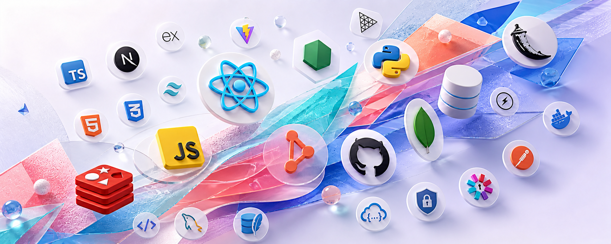

  

<h1 align="center">Hi, I'm Mayank Nihalani </h1>

  <strong>Full-Stack Developer &middot; AI Product Builder &middot; Backend-Focused Engineer</strong>

  I build thoughtful, scalable web products that turn complex workflows into clear, useful experiences.

  
  
  

---

## About me

I'm a final-year Computer Science Engineering student based in Jaipur, India. I enjoy designing full-stack applications where product thinking, resilient backend systems, and polished interfaces meet. My recent work focuses on AI-assisted tools, privacy-aware browser experiences, and developer-friendly web applications.

- 🧠 Exploring applied AI, backend architecture, secure authentication, and performance-conscious product design.
- 🤝 Open to meaningful open-source collaborations, product work, and freelance opportunities.
- 🌱 Sharpening data structures and algorithms alongside hands-on product engineering.

## Selected work

| Project | What I built | Core technologies |
| :-- | :-- | :-- |
| **[CareerPilot AI](https://github.com/Nihalani2004/CareerPilot-AI)** | A career-readiness workspace that turns résumés and job descriptions into explainable ATS insights, interview preparation, learning roadmaps, and tailored résumé PDFs. | React, Node.js, Express, MongoDB, Gemini, Puppeteer |
| **[AdaptiveWeb](https://github.com/Nihalani2004/AdaptiveWeb)** | A privacy-aware browser extension that detects micro-behaviours and offers helpful, non-disruptive UI adaptations such as reading support, summaries, and grounded shortcuts. | JavaScript, Chrome Extension, Next.js, MongoDB, Gemini |
| **[Sketchboard](https://github.com/Nihalani2004/Sketchboard)** | A local-first, hand-drawn diagramming application with canvas tools, grouping, snapping, undo/redo, and JSON/PNG export. | JavaScript, Vite, Konva, rough.js, Tailwind CSS |
| **[Imagify AI SaaS](https://github.com/Nihalani2004/Imagify-AI-Saas)** | A credit-based image-generation SaaS with authentication, generation history, Redis caching and rate limiting, and Razorpay payments. | React, Node.js, Express, MongoDB, Redis |

## Engineering toolkit

  

  Also working with Vite, Tailwind CSS, GSAP, Three.js, Socket.IO, REST APIs, JWT-based authentication, and GitHub Actions.

## GitHub at a glance

  
  

## Beyond the code

I care about building software that earns trust: clear user flows, practical privacy decisions, predictable performance, and documentation that makes a project easier to use and extend.

  <picture>
    <source media="(prefers-color-scheme: dark)" srcset="https://raw.githubusercontent.com/Nihalani2004/Nihalani2004/output/github-snake-dark.svg" />
    <source media="(prefers-color-scheme: light)" srcset="https://raw.githubusercontent.com/Nihalani2004/Nihalani2004/output/github-snake.svg" />
    
  </picture>

  <em>Have an idea worth building? Let's connect and make it real.</em>

